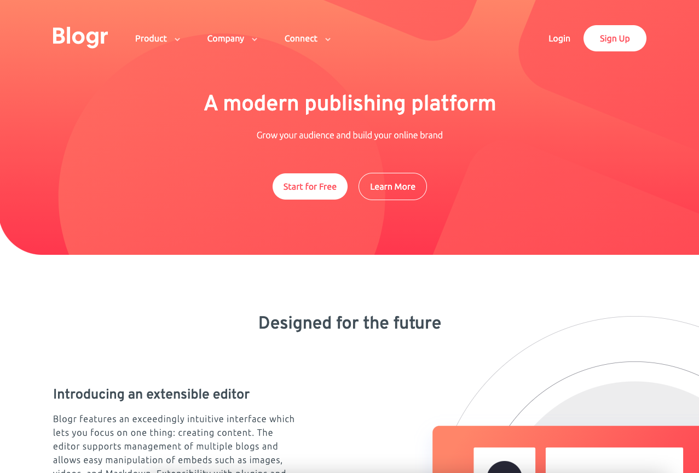

# Frontend Mentor - Blogr landing page solution

This is a solution to the [Blogr landing page challenge on Frontend Mentor](https://www.frontendmentor.io/challenges/blogr-landing-page-EX2RLAApP). Frontend Mentor challenges help you improve your coding skills by building realistic projects.

## Table of contents

- [Overview](#overview)
  - [The challenge](#the-challenge)
  - [Screenshot](#screenshot)
  - [Links](#links)
- [My process](#my-process)
  - [Built with](#built-with)
  - [What I learned](#what-i-learned)
- [Author](#author)

**Note: Delete this note and update the table of contents based on what sections you keep.**

## Overview

### The challenge

Users should be able to:

- View the optimal layout for the site depending on their device's screen size
- See hover states for all interactive elements on the page

### Screenshot

### Links

- Solution URL: [https://github.com/IsaacArnold/blogr-landing-page-main](https://github.com/IsaacArnold/blogr-landing-page-main)
- Live Site URL: [https://isaacarnold.dev/blogr-landing-page-main/](https://isaacarnold.dev/blogr-landing-page-main/)

## My process

### Built with

- Semantic HTML5 markup
- SCSS custom properties
- Flexbox
- CSS Grid
- Mobile-first workflow

### What I learned

I had some trouble with the positioning of the illustrations and background images. However I managed to achieve the desired outcome with lots of determination and Googling.

## Author

- Website - [Isaac Arnold](https://isaacarnold.dev)
- Frontend Mentor - [@yourusername](https://www.frontendmentor.io/profile/yourusername)
- Instagram - [@isaac.codes](https://www.instagram.com/isaac.codes/)
